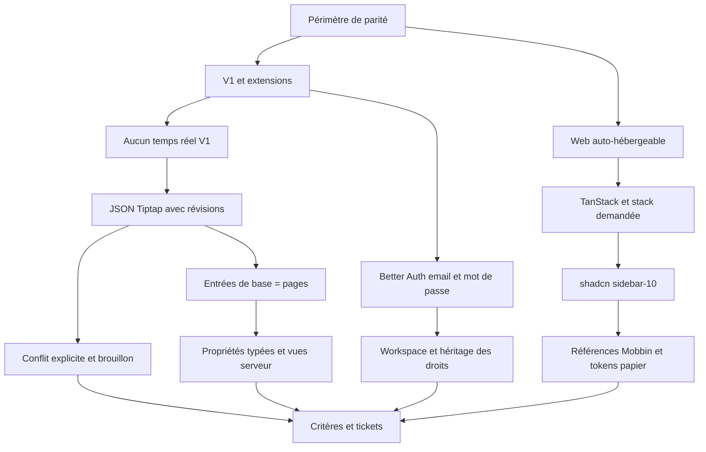

# Grill autonome — décisions closes pour le plan

L'utilisateur a explicitement demandé de poser les questions et de choisir les réponses de façon autonome. Cela remplace ici les étapes d'attente et de confirmation de grill-me/grilling. Ce document est un journal de décisions concis, pas une transcription de raisonnement interne.

## Arbre des dépendances

## Tour 1 — destination

| Question | Décision et motif | Conséquence |
| --- | --- | --- |
| Que signifie même fonctionnalité ? | Inventaire de parité explicite, livré par familles | La V1 ne sera pas appelée clone complet |
| Quelle plateforme en premier ? | Web responsive, auto-hébergement | Apps natives et offline complet ultérieurs |
| Quelle authentification ? | Better Auth email/mot de passe, conformément à la correction utilisateur | Pas de fournisseurs sociaux |
| Collaboration simultanée ? | Non, conformément à la correction utilisateur | Pas de présence, WebSocket ou CRDT |
| Quel design ? | Patterns Notion examinés dans Mobbin, tonalité papier légère | Tokens mesurables et références liées |
| Quelle sidebar ? | sidebar-10, conformément à la dernière demande | Adaptation de sa démonstration Next vers TanStack |
| Quelle licence ? | AGPL-3.0-or-later proposée pour préserver les modifications distribuées en service | Notice à fournir avec le code produit ; dépendances auditées |

## Tour 2 — architecture

| Question | Décision et motif | Conséquence |
| --- | --- | --- |
| Start ou Next ? | TanStack Start, demandé par la stack | Traduire les règles Next/RSC, versions compatibles à prouver |
| Combien de transports ? | oRPC pour le métier, Better Auth natif pour la session | Pas de seconde API CRUD parallèle |
| Microservices ? | Monolithe modulaire | Déployer simplement ; extraire un worker au besoin |
| Où vit le texte ? | JSON Tiptap canonique par page | Schéma versionné et IDs de blocs stables |
| Comment protéger une sauvegarde ? | Compare-and-swap de révision et idempotence | Deux onglets ne peuvent pas écraser silencieusement leurs textes |
| Faut-il une base de blocs SQL ? | Pas en V1 | Liens et recherche sont des projections reconstruisibles |
| Que fait Zustand ? | État UI uniquement | Aucun doublon de Query, Tiptap, session ou URL |
| Quelle librairie de drag ? | Tiptap pour le texte, dnd-kit pour les collections et l'arbre | Chaque domaine garde sa sémantique de déplacement |
| Que signifie scalable ? | Index, pagination, limites et budgets mesurés | Aucune promesse de volumétrie sans banc de test |

## Tour 3 — invariants et scénarios adverses

| Scénario | Décision | Vérification |
| --- | --- | --- |
| Deux onglets ouvrent révision 12 et sauvegardent | Le premier obtient 13 ; le second reçoit CONFLICT et conserve son brouillon | Test concurrent sur PostgreSQL réel |
| Le serveur écrit mais l'accusé de réception se perd | Même mutationId renvoie le reçu existant | Retry sans nouvelle révision |
| L'utilisateur tape pendant une sauvegarde | La réponse ne nettoie que la génération envoyée | Dernière saisie encore sale jusqu'au prochain ACK |
| Un refetch revient pendant la saisie | Il n'écrase pas l'état Tiptap sale | Test réseau avec réponses retardées |
| Un parent est déplacé sous son enfant | Refus transactionnel | Deux déplacements concurrents sont aussi vérifiés |
| Un déplacement expose une page privée | Aperçu du changement de portée, validation des droits, confirmation de l'action de partage | Aucun changement de droits incident caché |
| Une page a deux liens dans deux documents | Une identité, deux références ; un seul parent canonique | Déplacer l'un des liens ne déplace pas la page |
| Une entrée est ouverte depuis table et board | Même page, mêmes propriétés | Mutation visible après invalidation des deux vues |
| Une personne devine l'ID d'un autre espace | Refus par politique d'accès pour chaque chemin | Tests sur lecture, recherche, export et fichiers |
| Changer le type d'une propriété perd des valeurs | Aperçu et conversion contrôlée | Rapport des valeurs incompatibles |
| Une formule crée un cycle | Détection dans le graphe et erreur explicite | Temps/mémoire bornés ; phase 2 |
| Un fichier ou lien injecte du contenu actif | Validation, rendu sûr, stockage privé et URLs bornées | Cas HTML/URL malveillants et accès croisé |

## Tour 4 — exploitation et exécution

| Question | Décision | Condition de réexamen |
| --- | --- | --- |
| Où suivre les tâches ? | Markdown local ; aucun remote présent | Choix ultérieur d'un tracker |
| Faut-il invoquer 37 skills à chaque changement ? | Tous installés, workflows applicables activés au besoin | Type de tâche réel |
| Comment reprendre après perte réseau ? | Brouillon local et révision serveur relue avant sauvegarde | Projet offline ultérieur |
| Comment opérer le produit ? | Docker, PostgreSQL, assets sauvegardés, SMTP | Plusieurs replicas ou volumes importants |
| Comment juger une livraison ? | Parcours réels, critères de fiabilité et install vierge | Aucun remplacement par une capture statique |

Frontière de décisions vide **pour ce plan** : aucun arbitrage utilisateur bloquant restant. Les tests de compatibilité de packages et les investigations de phase 2 sont des travaux explicitement planifiés. Ils ne sont pas présentés comme déjà résolus expérimentalement.
