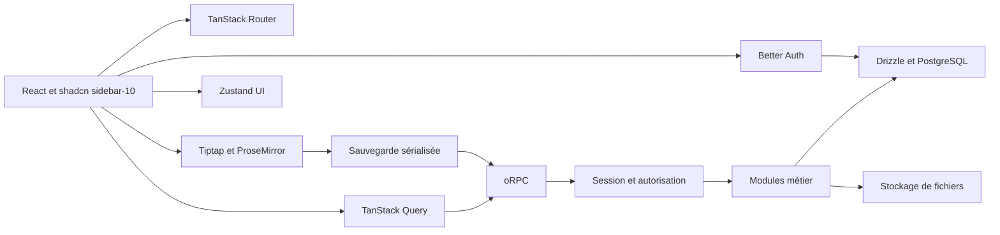

# DigiPM — plan d'implémentation d'un espace de travail type Notion

Date : 6 septembre 2026. Statut : plan de référence ; implémentation fonctionnelle en cours de validation. Voir [le rapport de livraison](validation/delivery.md) pour les fonctions effectivement livrées et les écarts.

## 1. Décision produit

Construire une application open source auto-hébergeable dont les interactions, l'organisation des pages et les bases de données reproduisent progressivement l'expérience Notion. Nom de travail : **DigiPM**. Interface française par défaut, textes externalisés pour une traduction future. Licence proposée pour notre code : **AGPL-3.0-or-later** ; conserver les notices des dépendances et publier les instructions d'auto-hébergement lors de la livraison.

Demandes fermes : TanStack, Drizzle, PostgreSQL, shadcn/ui **sidebar-10**, oRPC, Zustand, Tiptap et déplacement des textes/blocs. **Better Auth avec email et mot de passe uniquement. Aucun temps réel pour l'instant.** Les choix restants sont tranchés par l'agent, comme demandé.

« Exactement Notion » devient une matrice de parité mesurable. Le produit Notion couvre aussi IA, agents, automatisations, publications et applications Mail/Calendar ; ces domaines ne sont pas assimilés à un éditeur terminé. Le [centre d'aide officiel](https://www.notion.com/help) constitue l'inventaire externe, figé pour ce plan à la date ci-dessus. Chaque lot doit être démontrable ; les extensions restent visibles dans la feuille de route.

Ce document conserve les objectifs initiaux. Le rapport de livraison distingue les fonctions implémentées, les validations réalisées et les critères encore ouverts ; une mention ci-dessous ne prouve pas sa disponibilité.

## 2. Stack retenue

| Domaine | Choix | Responsabilité |
| --- | --- | --- |
| Langage / runtime | TypeScript strict, Node LTS, pnpm workspaces | Exécution portable et versions verrouillées |
| Application | React + TanStack Start + Vite | Pages, rendu initial, endpoints serveur |
| Navigation | TanStack Router | Routes typées, loaders, paramètres de recherche validés |
| Données client | TanStack Query + intégration oRPC | Cache serveur, mutations, invalidation ciblée |
| Backend métier | oRPC, ligne stable cohérente | Contrats typés, validation, autorisation, erreurs |
| Authentification | Better Auth, adaptateur Drizzle PostgreSQL | Inscription, connexion, session, réinitialisation du mot de passe |
| Persistance | PostgreSQL + Drizzle ORM / Kit | Schéma, contraintes, transactions, migrations relues |
| UI | Tailwind CSS + shadcn/ui + Lucide | Composants accessibles et tokens papier |
| Navigation visuelle | **shadcn sidebar-10** | Sidebar, favoris, arbre de pages, switcher, menus |
| Éditeur | Tiptap 3 + ProseMirror, extensions open source | Blocs, sélection, historique local, commandes |
| Drag de texte / blocs | DragHandle Tiptap / transactions ProseMirror | Déplacement sémantique dans le document |
| Drag hors éditeur | **dnd-kit**, API stable vérifiée au bootstrap | Arbre de pages, favoris, cartes et colonnes |
| Tables | TanStack Table + Virtual | Table éditable, colonnes et fenêtrage des lignes |
| État UI partagé | Zustand | Panneaux, palette de commandes, préférences |
| Formulaires | React Hook Form + Zod | Authentification et formulaires de paramètres |
| Validation | Zod | Entrées, filtres, documents, configuration |
| Fichiers | Adaptateur stockage local puis S3 compatible | Upload autorisé et accès privé |
| Recherche V1 | PostgreSQL full-text + pg_trgm | Titres, contenu, pertinence et tolérance limitée |
| Emails | SMTP ; Mailpit en développement | Récupération de compte et invitations |
| Tests | Vitest, PostgreSQL réel, Playwright | Invariants, contrats, parcours et captures |
| Observabilité | Logs structurés + métriques HTTP/SQL | Latences, erreurs, conflits, sauvegardes échouées |
| Livraison | Docker Compose puis images déployables | Installation reproductible et restauration |

Les versions exactes seront sélectionnées et verrouillées au ticket 01 après compilation de l'ensemble. Les docs Start consultées indiquent encore un statut RC, tandis que certains exemples oRPC courants ciblent une bêta : utiliser une ligne cohérente, sans mélange de guides. Les différences d'imports Better Auth/Drizzle et dnd-kit sont consignées dans la [recherche technique](research/technical-sources.md). Le lockfile pnpm est désormais présent et le build est validé ; voir le rapport de livraison pour les versions retenues.

Le socle V1 n'a besoin ni de Redis, ni de serveur WebSocket, ni de CRDT, ni de Pusher, ni de service cloud Tiptap. Les éventuels peers de package ne doivent pas activer une fonctionnalité de collaboration. Trigger.dev reste une option de phase ultérieure, derrière le traitement de tâches longues ; l'authentification n'en dépend pas.

## 3. Architecture et propriété de l'état



Monolithe modulaire : un déploiement web au départ, un worker seulement lorsque les traitements l'exigent. Organisation cible, à créer au bootstrap :

```text
apps/web/                  # TanStack Start, routes et fonctionnalités UI
  src/routes/
  src/features/            # auth, workspace, pages, editor, databases
  src/components/ui/       # composants shadcn générés, dont sidebar
packages/contracts/        # schémas publics et contrats oRPC
packages/server/           # procédures et modules métier privés au serveur
packages/db/               # schémas Drizzle, migrations, connexion
packages/editor/           # schéma de document, extensions et rendu partagé
docs/                      # décisions et références
.scratch/notion/           # spec et tickets locaux
```

Les routes et procédures sont minces. Les modules `Pages`, `Documents`, `Databases`, `Access` et `Files` encapsulent leurs transactions et invariants. Éviter un repository générique qui expose chaque opération SQL au frontend. Les interfaces concrètes utiles sont par exemple `movePage`, `saveDocument`, `queryView`, `updateProperty` : le contrôle des droits et la cohérence ne reposent pas sur la bonne volonté de chaque appelant.

| État | Autorité | Règle de synchronisation |
| --- | --- | --- |
| Session | Better Auth | Vérifiée au serveur ; aucune copie de token dans Zustand |
| Pages, propriétés, membres | PostgreSQL, cache Query | Cache segmenté par utilisateur/workspace et invalidé après mutation |
| Vue et filtre navigables | Router | Validation URL ; une seule autorité, sans miroir nuqs |
| Document non enregistré | Tiptap | Une instance par page ouverte ; refetch interdit d'écraser un document sale |
| Ouverture sidebar | SidebarProvider shadcn | Propriétaire unique ; persistance via adaptateur si nécessaire |
| Arbre développé, panneaux | Zustand | Sélecteurs ciblés ; aucune liste de pages dupliquée |
| Brouillons de secours | IndexedDB | Clé utilisateur/workspace/page ; purge à la déconnexion selon politique explicite |

QueryClient et contexte d'auth sont propres à la requête SSR. Le code serveur et le driver PostgreSQL ne doivent pas entrer dans le bundle navigateur. Les mutations optimistes portent sur les métadonnées et propriétés avec rollback ; l'éditeur conserve son état et attend l'accusé de réception de sauvegarde.

## 4. Modèle de données

Toutes les tables de contenu portent `workspace_id`. Les FK composites et contraintes empêchent les références inter-espaces. Les identifiants métier sont des UUID ; ceux de Better Auth suivent son schéma généré compatible, sans conversion forcée.

| Ensemble | Données principales et contraintes |
| --- | --- |
| Auth Better Auth | Tables user, session, account, verification générées depuis la configuration retenue |
| workspaces / workspace_members | Nom, propriétaire ; unicité workspace/user ; rôle owner, editor ou viewer |
| workspace_invitations | Email, rôle borné, expiration, jeton haché ; acceptation vérifie l'identité |
| pages | Titre, parent, icône, cover, ordre, type, auteur, révision métadonnées, dates de corbeille |
| page_documents | Une ligne par page : JSON Tiptap, schema_version, revision, texte de recherche dérivé |
| document_versions | Snapshots de restauration, auteur, révision, motif, rétention |
| mutation_receipts | Idempotence : acteur, page, mutationId, empreinte du payload, résultat ; unicité |
| page_access | Racine de partage héritée, audience workspace/private, grants explicites et version d'accès |
| favorites / recent_pages | Unicité utilisateur/page ; pas de copie du document |
| databases / data_sources | Base conteneur et source avec propriétés ; une source par base en V1 |
| database_entries | Liaison source/page, unicité d'appartenance V1 ; l'entrée reste une page |
| property_definitions / property_options | Types autorisés, options et configuration validée |
| property_values | Une valeur scalaire typée par entrée/propriété ; révision ; colonnes texte/nombre/bool/date selon type |
| entry_options / entry_people | Valeurs multiples avec FK vers options/membres autorisés |
| database_views | Disposition, configuration, filtres AST, tris, colonnes, version de schéma |
| page_links | Index dérivé de liens et identifiants de blocs ; source reconstruisible |
| assets | Clé stockage, taille, type contrôlé, uploader, rattachement et état |
| comments / notifications | Phase 2 ; ancre de bloc stable, résolution et lecture |
| relations / computed_values | Phase 2 ; références typées, résultats dérivés et version de calcul |
| published_pages | Phase 2 ; publication explicite, slug, portée, révocation |

Le type d'une propriété est contrôlé dans une transaction qui verrouille sa définition ; les contraintes de colonnes imposent une forme valide de valeur. Un changement de type crée un travail de conversion avec aperçu des pertes, jamais une réinterprétation silencieuse. Le titre utilise `pages.title`, pas une deuxième copie dans `property_values`.

L'arborescence repose sur `parent_id` et un ordre fractionnaire stable. Un déplacement vérifie les droits source/destination, l'appartenance au même espace, la corbeille et l'absence de cycle. Sérialiser les déplacements concurrents par verrou transactionnel sur le workspace en V1 ; rééquilibrer l'ordre sous verrou si nécessaire. Le déplacement d'un sous-arbre peut changer ses droits hérités : prévisualiser ce changement avant confirmation de l'action utilisateur.

Les références de page dans un bloc sont des liens ; elles ne définissent pas l'arbre. La duplication profonde remappe les IDs de pages et de blocs et les liens internes au sous-arbre copié. La suppression d'un parent rend ses descendants inaccessibles ; la restauration conserve les descendants déjà supprimés auparavant et replace à la racine si le parent initial n'existe plus.

Index prioritaires : membres workspace/user ; pages workspace/parent/ordre ; source/entrée ; valeurs property/type/valeur/entrée ; révisions page/date ; index GIN pour le texte. Pagination par curseur avec ordre total incluant l'ID. Requêtes de base bornées et filtrées au serveur, sans charger toute la source côté client.

## 5. Authentification et accès

Parcours : inscription email/mot de passe → création idempotente du premier workspace → page d'accueil. Connexion, déconnexion, récupération du mot de passe, changement de mot de passe et gestion du profil font partie du socle. Pas d'OAuth, SSO, magic link, passkey ou MFA en V1.

Better Auth conserve `/api/auth/*`, son client et son middleware de cookies TanStack. `emailAndPassword.enabled` active le mode demandé. Le serveur appelle l'API de session Better Auth avant les opérations privées. oRPC gère ensuite l'autorisation métier ; il ne réimplémente pas l'authentification. [Intégration officielle](https://better-auth.com/docs/integrations/tanstack).

Cookies HttpOnly, Secure en production, origine autorisée, limitation d'essais persistante compatible déploiement, erreurs de récupération non révélatrices et jetons expirables. SMTP est requis pour le reset en production, Mailpit suffit localement. Inscription personnelle possible immédiatement ; une adresse doit être vérifiée avant d'accepter une invitation associée à cette adresse. L'inscription publique peut être désactivée pour un auto-hébergement privé après création de l'administrateur.

L'autorisation s'applique à chaque lecture et mutation, y compris recherche, export, téléchargement, historique, liens et suggestions. Un ID n'est jamais une preuve d'accès. Les clauses workspace sont obligatoires ; des tests d'isolation utilisent deux espaces et trois rôles. Une mutation revalide l'accès et l'état de corbeille dans sa transaction, avec un ordre de verrouillage partagé avec révocation et déplacement ; une permission vérifiée avant une attente réseau ne suffit pas à autoriser une écriture tardive.

V1 : owner administre l'espace, editor édite le contenu autorisé, viewer consulte. Une racine privée est accessible à son créateur et ses invités explicites ; l'administration de l'espace n'accorde pas automatiquement lecture des pages privées. Les descendants héritent ; aucune exception imbriquée en V1. Avant cette tranche de partage, l'espace initial possède uniquement son propriétaire. L'interface masque les actions interdites, le serveur les refuse indépendamment.

## 6. Éditeur Tiptap et sauvegarde sans temps réel

Un seul document ProseMirror par page. Blocs de base : texte, titres 1–3, listes, tâches, toggle, citation, callout, séparateur, code, lien, image, pièce jointe, table simple et lien de sous-page. Les types avancés apparaissent en phase 2 : colonnes, formules mathématiques, table des matières, embeds et blocs synchronisés.

Interactions : commande `/` filtrable au clavier ; menu de bloc ; barre contextuelle sur sélection ; conversion de type ; indentation ; raccourcis ; copier/coller texte, HTML et Markdown ; annuler/rétablir ; déplacer un bloc puis annuler ce déplacement en une opération. Chaque bloc a un ID stable, remappé à la duplication/copie, conservé au déplacement. Le code Tiptap open source fournit le moteur et certaines extensions ; nos menus, nœuds et cas avancés sont du code applicatif à construire.

Le drag interne passe par Tiptap/ProseMirror pour préserver sélection et historique. dnd-kit gère le tree, les favoris et le board, avec handles dédiés, activation distincte du clic et alternative clavier. Ne pas monter un sortable dnd-kit autour de chaque paragraphe éditable. L'extension DragHandle React et ses peers doivent être testés sans activation de collaboration ; les [sources officielles](research/technical-sources.md) détaillent ce contrôle.

Protocole `saveDocument(pageId, expectedRevision, mutationId, schemaVersion, content)` :

1. Valider session, accès, taille maximale et schéma de chaque nœud ; refuser les types inconnus en écriture.
2. Débouncer à 700 ms et sérialiser les requêtes par page. Si l'utilisateur continue d'écrire pendant une requête, conserver le dernier état pour la suivante.
3. Dans une transaction, vérifier la révision et enregistrer contenu, nouvelle révision, index de recherche dérivé et reçu d'idempotence. Un retry du même mutationId/payload renvoie le même résultat ; un payload différent pour le même ID est rejeté.
4. Si la révision diverge, renvoyer `CONFLICT` avec la révision actuelle. Conserver le brouillon ; proposer recharger après sauvegarde locale, comparer/exporter ou créer une copie. Aucun merge automatique en V1.
5. N'afficher « Enregistré » que si le serveur a confirmé la dernière génération locale. Une réponse ancienne ne remet pas un document plus récent à l'état propre.

États visibles : enregistré → modifications locales → enregistrement → enregistré ; branches erreur réseau, session expirée et conflit. Conserver un brouillon IndexedDB pendant la saisie. À la reconnexion, relire la révision avant de reproposer la sauvegarde. Ne pas dépendre d'un `beforeunload` ou d'un beacon pour la durabilité ; avertir à la navigation quand il reste des changements. Refetch au focus seulement si le document est propre. Pas de polling rapide ni de promesse de mode hors ligne complet.

Historique : checkpoint périodique lorsqu'il y a des modifications, avant restauration et actions destructives ; conserver séparément la révision courante de concurrence. Valeurs proposées : snapshot toutes les cinq minutes d'édition et rétention 30 jours configurable. Une restauration crée une nouvelle révision et préserve l'état actuel dans l'historique.

## 7. Bases de données

Une entrée ouvre la même page depuis toutes les vues. V1 : table, board, liste et galerie ; propriétés titre, texte, nombre, checkbox, select, multi-select, statut, date/plage, personne, URL, email, fichiers, auteur et dates automatiques. Ajouter le calendrier à la fin de la V1 si les critères de fiabilité sont acquis ; il possède son ticket propre.

Vue persistée : nom, layout, colonnes visibles/ordre/largeur, filtre logique AND/OR borné, tris multiples, groupement et page size. L'URL sélectionne la vue et peut contenir des filtres temporaires ; enregistrer la vue est une action explicite, sans modifier silencieusement la vue partagée.

Compiler les filtres validés vers du SQL paramétré avec opérateurs autorisés selon le type. Limiter profondeur, clauses et temps de requête. Le board pagine par groupe et applique un changement de propriété atomique lors du drop. Le déplacement manuel est désactivé dans une table triée ; l'UI explique le tri actif. Les mises à jour de cellule utilisent leur révision ; un renommage de page ne doit pas faire échouer une édition de propriété sans rapport.

Phase 2 : relations bidirectionnelles, rollups, moteur de formules parsé/interprété avec budget de calcul et détection des cycles, timeline, agrégats, vues liées, modèles récurrents et layouts d'entrée. Les formules ne s'exécutent jamais par `eval`. La compatibilité de formule Notion sera définie par fonctions prises en charge et fixtures, sans annoncer une équivalence générale.

## 8. Parité et séquence de livraison

| Famille | V1 utilisable | Phase 2 : parité workspace | Phase 3 : écosystème |
| --- | --- | --- | --- |
| Navigation | sidebar-10, switcher, arbre, favoris, récents, recherche, corbeille | Teamspaces, accueil personnalisable, notifications | Navigation desktop/mobile dédiée |
| Pages | Imbrication, titre, icône, cover, duplication, liens, import Markdown | Wiki, vérification, backlinks riches, modèles partagés | Marketplace de modèles |
| Édition | Blocs de base, slash, menus, drag, undo, autosave, historique | Colonnes, maths, embeds, boutons, blocs synchronisés | IA d'écriture et agents |
| Bases | Propriétés typées, table/board/liste/galerie, tri/filtre, CSV | Calendrier si non livré V1, relations, rollups, formules, timeline, agrégats, vues liées | Graphiques, formulaires, dashboards, feed, map, multisource |
| Collaboration | Invitations et permissions, édition asynchrone avec conflits | Commentaires, mentions, notifications par rechargement | Temps réel uniquement après nouvelle décision explicite |
| Publication | Export portable Markdown/JSON/CSV | Pages publiques, liens révocables, sites simples | Domaines personnalisés et publication avancée |
| Intégrations | Fichiers et SMTP auto-hébergés | API publique, webhooks, imports Notion ZIP avec rapport de pertes | Automatisations, connecteurs et agents externes |
| Plateformes | Web responsive | PWA et récupération de brouillons renforcée | Offline complet, apps natives, Mail/Calendar comme produits séparés |
| Administration | Membres, rôles, sauvegarde/restauration | Journal d'audit, quotas, rétention configurable | Administration entreprise, SSO/SCIM si demandé |

Les [vues documentées par Notion](https://www.notion.com/help/category/database-views/all) servent de couverture fonctionnelle externe. Les autres colonnes sont nos décisions de séquencement, pas une déclaration de disponibilité.

Jalons :

1. **Socle démontrable** : installer les packages compatibles, créer un compte, ouvrir un workspace dans sidebar-10, enregistrer une première page après rechargement.
2. **Écriture fiable** : Tiptap, autosave, conflits, drag, arborescence et restauration validés.
3. **Espace utilisable** : recherche, fichiers, accès asynchrones et récupération de compte terminés.
4. **Bases utilisables** : propriétés, table et autres vues sur les mêmes entrées, import/export borné.
5. **Release auto-hébergeable** : installation propre, migrations, tests, performances, accessibilité et restauration vérifiées.
6. **Parité avancée** : ouvrir les tickets de phase 2 à partir de la matrice, après critères et dépendances détaillés.

Le [backlog](../.scratch/notion/README.md) découpe les jalons en tranches verticales. Aucune date ferme n'est annoncée avant mesure de vélocité sur le premier jalon. Budget indicatif de planification : plusieurs mois pour une V1 solide avec une petite équipe expérimentée ; la parité étendue constitue un programme distinct. Réestimer après les tickets 01–06 à partir du temps réel, des défauts et des tests du drag.

## 9. Fiabilité, performance et livraison

Critères proposés, à mesurer sur une machine et un jeu de données documentés au ticket de performance : éditeur avec 1 000 blocs représentatifs, workspace avec 10 000 pages, source avec 100 000 entrées et 20 propriétés. Support V1 borné à 2 MiB de JSON par page et 25 MiB par fichier, configurable ; expliquer tout dépassement sans tronquer les données.

Cibles : saisie sous 50 ms p95, API courante sous 300 ms p95 côté serveur, premier lot de résultats de recherche sous 500 ms p95, page interactive sous 2,5 s sur le profil réseau retenu. Ce sont des budgets de validation, pas des performances obtenues. Pagination et virtualisation concernent les tables et l'arbre ; ne pas virtualiser naïvement le contenu éditable avant mesure des conséquences sur sélection et copier/coller.

Tests bloquants : deux tenants ne voient jamais leurs contenus ; deux sauvegardes concurrentes ne perdent pas une édition ; retries idempotents ; déplacement de sous-arbre sans cycle ; undo après drop ; filtrage par types ; lecture seule inviolable ; restauration ; suppression puis accès par lien direct ; injection HTML/URL et documents mal formés ; emails de reset non réutilisables ; navigation clavier et tactile.

Playwright : Chromium pour chaque changement, puis Firefox/WebKit sur éditeur/auth avant release. Inclure composition IME, accents, gros collage, sélection de listes imbriquées et drag hors écran. Captures visuelles avec contenu déterministe en 1440, 1024 et 390 px ; validation des états de `sidebar-10`, des menus et des erreurs. WCAG AA : contraste mesuré, focus visible, noms accessibles, reduced motion ; l'alternative clavier fait partie de chaque drag.

Uploads : taille/MIME contrôlés, HTML actif exclu, téléchargement privé autorisé à chaque accès, URLs externes et embeds limités ; aucun fetch arbitraire du serveur vers une URL utilisateur. Index/recherche/publication appliquent les mêmes droits que les pages. Les journaux excluent contenu des pages, secrets, mots de passe et jetons.

Docker Compose local : app, PostgreSQL, Mailpit et volume d'assets. Prod mono-instance possible avec volumes sauvegardés ; avant plusieurs replicas, stockage partagé et limitation de requêtes partagée, sessions/receipts persistants. Migrations Drizzle générées, inspectées et appliquées une fois par release. Séparer migration de démarrage web. Backup quotidien base + assets ; exercice de restauration mensuel ; cibles initiales RPO 24 h / RTO 4 h à vérifier, puis PITR selon besoin. Un restaurateur doit pouvoir revenir à la version applicative compatible avec le schéma.

## 10. Condition de fin

La **V1** est terminée quand ses tickets sont `done`, les parcours réels fonctionnent sur un environnement vierge, les critères de sécurité/fiabilité passent et la documentation d'exploitation est utilisable par une autre personne. La **parité Notion** reste partielle tant que des lignes de la matrice sont différées. Le temps réel reste exclu tant qu'une nouvelle demande ne l'autorise pas.

Documents associés : [grill autonome](decisions/grill-autonome.md), [design et sidebar-10](design/notion-reference.md), [audit des 17 règles](research/rules-audit.md), [sources techniques](research/technical-sources.md), [spec](../.scratch/notion/spec.md), [tickets](../.scratch/notion/README.md).
